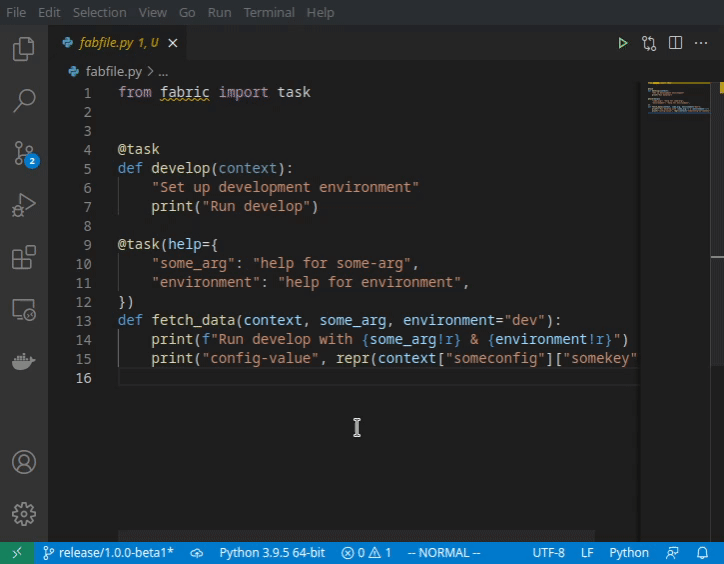

# VS-Code Task Provider for fabric


[](https://github.com/exhuma/task-provider-fabric/issues)
[](https://github.com/exhuma/task-provider-fabric)
[](https://github.com/exhuma/task-provider-fabric)

## Source Code, Issues & Feedback

- [Repository](https://github.com/exhuma/task-provider-fabric)
- [Issue Tracker](https://github.com/exhuma/task-provider-fabric/issues)

## Description

This extension provides VS-Code task executions for tasks defined using
"fabric" (https://www.fabfile.org).

<p align="center">
  
  <br/>
  <em>(demo)</em>
</p>

## Usage

- Install the extension
- Define tasks in a fabfile (default: `fabfile.py` in the workspace folder)
- Execute the "Tasks: Run Task" command in VS-Code (default shortcut: `CTRL+SHIFT+P`)
- Select "fabric"
- Select the task to run

## Command-Line Arguments

Some tasks require arguments. To add arguments to the task, configure a task (using the gear icon at the right of the task-name) and add the key `args` to the task definition.

### Example

```json
// See https://go.microsoft.com/fwlink/?LinkId=733558
// for the documentation about the tasks.json format
{
  "version": "2.0.0",
  "tasks": [
    {
      "type": "fabric",
      "task": "the-task-name",
      "args": ["--port", "8080"],
      "problemMatcher": [],
      "label": "Run something"
    }
  ]
}
```
